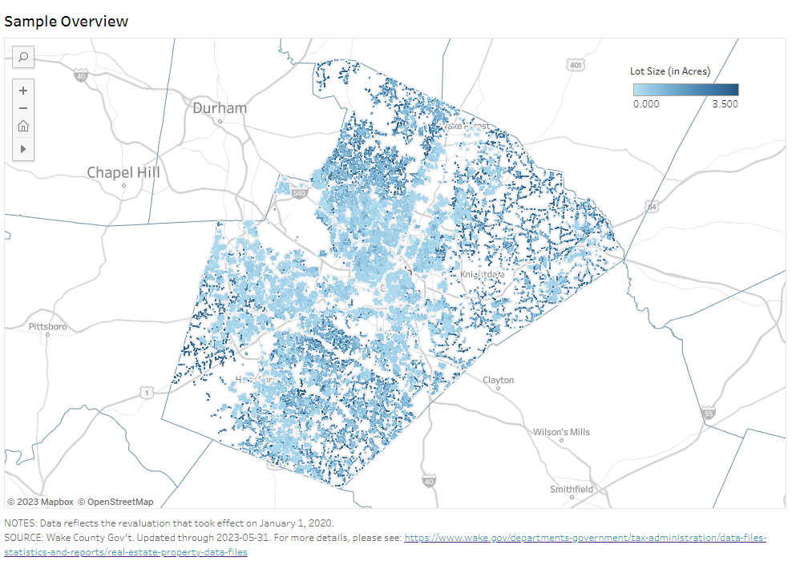
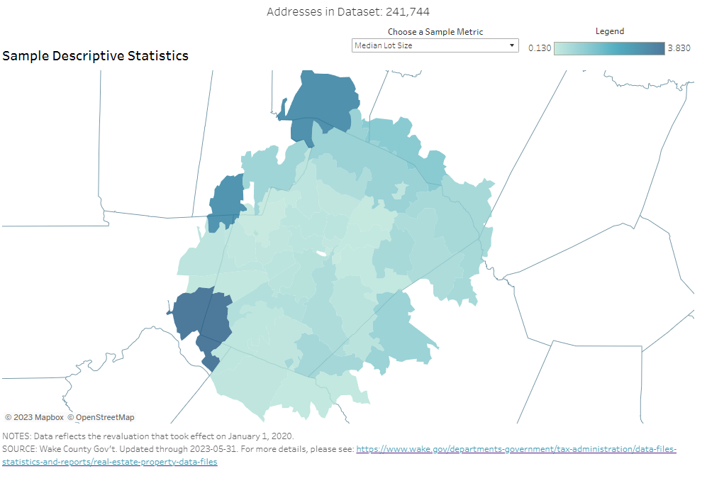
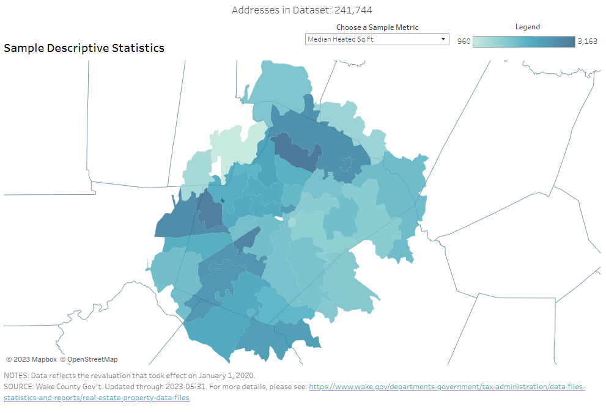
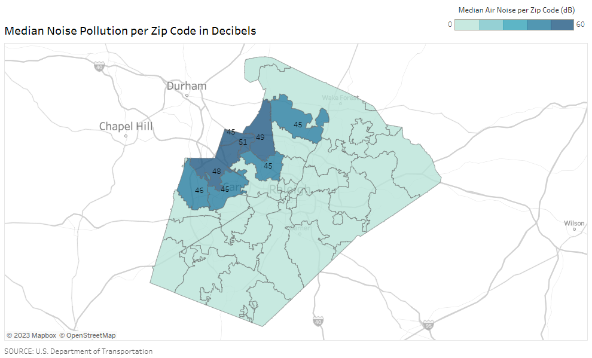
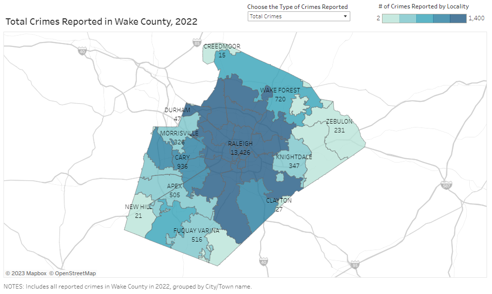

# Wake County Housing Price Analysis: External Factors
## Using Python, QGIS, SQLite, and Tableau to analyze the effects of external factors, such as noise levels and crime rates, on home values in Wake County.

### Question
When looking at houses, what factors are considered outside of the property itself? How much do they affect housing prices? This project aims to evaluate the effects, if any, that noise levels and crime rates have on the values of single-family homes in Wake County, NC.

### Data
* [Wake County residential data](https://www.wake.gov/departments-government/tax-administration/data-files-statistics-and-reports/real-estate-property-data-files)
  * Total value, site address, city, zip code, planning jurisdiction, zoning, acreage, heated area, age, bath count, remodel/addition status, style
* [USDOT National Transportation Noise Map data](https://maps.dot.gov/BTS/NationalTransportationNoiseMap/)
  * Noise rasters with average transportation-related decibel levels over a 24-hour period, to assess noise levels of properties
* [Local City Police Department crime data in Wake County](https://www.wake.gov/departments-government/city-county-bureau-identification-ccbi/criminal-arrest-records)
  * Crime counts by municipality; separated into personal, property-based, and drug-based crimes

### Method
* Residential Data:
  * Original Values:
    * Using the Wake County's given records of all buildings and addresses within its borders, the data was narrowed down to single-family homes in a residential district that are owned by individuals (e.g. as opposed to a corporation). Property detail fields were then altered to more easily show the wanted values:
      * The year built was transformed to show each building's age (e.g. `year_built` = 2018 was changed to `age` = 5).
      * Assessed building and land values were combined into total value for each property.
      * If an address had a year of remodeling or a year of addition, it was converted to a boolean value of whether or not the property has had a remodel or addition.
    * Other fields were also transformed for better machine readability for a later phase of the project.
  * Geocoding Values:
    * Using two geocoding websites ([geo.cencus.gov](https://geocoding.geo.census.gov/geocoder/locations/addressbatch?form) and [geoapify.com](https://www.geoapify.com/tools/geocoding-online)), the addresses were checked for matches to find latitude and longitude values for each property. After cleaning, the coordinates were checked against a GeoJSON polygon of Wake County to confirm that the correct coordinates were found.
* Noise Data:
  * Using QGIS, the noise raster given by the NCDOT was narrowed down to Wake County, and the coordinates of each property in the residential dataset were overlaid and given a corresponding decibel level.
    * Notes: As explained by the NCDOT, the values of the noise raster were created over a 24-hour period to show approximate average decibel levels at 68°F and 50% relative humidity, and are not an accurate representation of exact decibel levels at a given time. Values that are shown as null are assumed to be roughly 35dB (for reference, rustling leaves are around 20dB).
  * To better visualize properties with significant noise (assumed as >35dB), each address was given both exact decibel levels and a relative scale from 1 to 5.
* Crime Data:
  * Given the data from Wake County in 2022, arrest locations were extracted to approximate areas with high crime.
    * Note: With the format of the data as-is, a significant number of locations are unable to be narrowed down to exact areas (e.g. the arrest occurred on a highway), and as such only the municipalities were extracted from the given arrest locations.
  * To offer an idea of the most-common categories of crimes, key words from the data's descriptions were used to gather totals for personal violence, property, and drug crimes. Due to some people being charged multiple times for the same crime (e.g. obtaining property under false pretenses and possessing stolen goods), there are separate counts of how many total crimes each category has, as well as how many names are under each category.

### Database
* SQLite
  * SQLite was chosen due to its portability and small size. It stores its database in a disk file in a directory, rather than relying on servers and separate programs, and uses minimal memory.
  * To set up the database, SQL statements were issued via Python's sqlite3 library to create, import, and join tables and data.

### Visualizations
Tableau was used to visually represent the above data. These figures can be seen [here](https://public.tableau.com/app/profile/stacy.burton/viz/WakeCountyHousingPriceAnalysis_16860264576320/SampleOverview?publish=yes).

  
An overview of the lots in Wake County.

  

  
Sample statistics, such as median lot size and median square footage.

  

  

  
Average noise levels per municipality, compared to the QGIS map.

  
  

  
Crime rates per municipality.

  

### Conclusion
From the current level of analysis, there is little evidence that noise levels and crime rates affect housing prices in Wake County, NC. Part of this could be due to the data used in this project; there were two major issues. For noise levels, the information from the DOT is an average over 24 hours, which may not accurately represent actual noise levels for a given area. With further research, it may be possible to find or build the data for maximum and minimum decibels generated by certain roads, intersections, airways, and train tracks, which could offer a more complete perspective. For the crime data, I could not reliably focus in on crime locations, therefore tying crime rates to municipalities rather than smaller areas (e.g. zip codes). This prevents the data from adding much value, particularly in large areas like Raleigh that are composed of multiple zip codes.

This is an expansion on [this](https://github.com/sburton7395/group_2) repository, under a separate account name.
